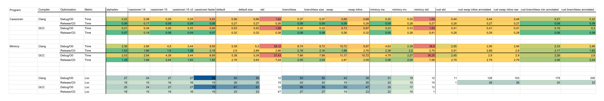

Here, we compare fixed-sized sort functions that were synthesized.

Sources:
- [AlphaDev](https://github.com/google-deepmind/alphadev)
- [Shorter and faster than Sort3AlphaDev](https://export.arxiv.org/pdf/2307.14503v1)
    - https://github.com/cassioneri/sort3
- [Mimicry-ai](https://github.com/mimicry-ai/sort)
- Std
- Our other synthesis repositories

Languages:
- C++
- Rust
    - `cargo rustc --release -- --emit asm`

Our baseline is the default C/Rust sort function with and without branches.

Resources:
- [measure instructions](https://stackoverflow.com/questions/13313510/quick-way-to-count-number-of-instructions-executed-in-a-c-program)


Results: https://docs.google.com/spreadsheets/d/1KrTYNVt-A_0IoiN0O6RWO8vJDD5ZJGBcsyh7__rFS6o/edit?usp=sharing



In conclusion, alphadev is quite good and leads the benchmarks.
`cassioneri 15 v2` is also very fast but does not work on negative numbers (both `cassioneri 15` and `cassioneri 15 v2` do assume non-negative numbers).

The manual branchless approach (shown below) is competitive to the other implementations (with a slight slowdown compared to alphadev depending on the benchmark).
The std sort is surprisingly bad which might be due to an overhead (that would need partial evaluation to be resolved).

Branchless implementation:
```C
void sort3_branchless(int *buffer) {
  int a = buffer[0];
  int b = buffer[1];
  int c = buffer[2];
  int x = a > b;
  int y = a > c;
  int z = b > c;
  buffer[x+y] = a;
  buffer[1-x+z] = b;
  buffer[2-y-z] = c;
}
```

Note that our synthesized algorithms (in `generated`) are 10-15% faster than AlphaDev in our benchmarks.
A big improvement (over AlphaDev) was the reordering of the instructions. 
Especially, the move from the buffer to the registers at the beginning improves the performance.

Stats:
- Synthesis in 30s
- Synthesis of all algorithms in 2h

More information will follow soon.


<!-- llvm-mca -mcpu=btver2 ./test_mimicry/out/g++.O3/test_correct.s > ./test_mimicry/out/g++.O3/llvm_mca.txt -->
